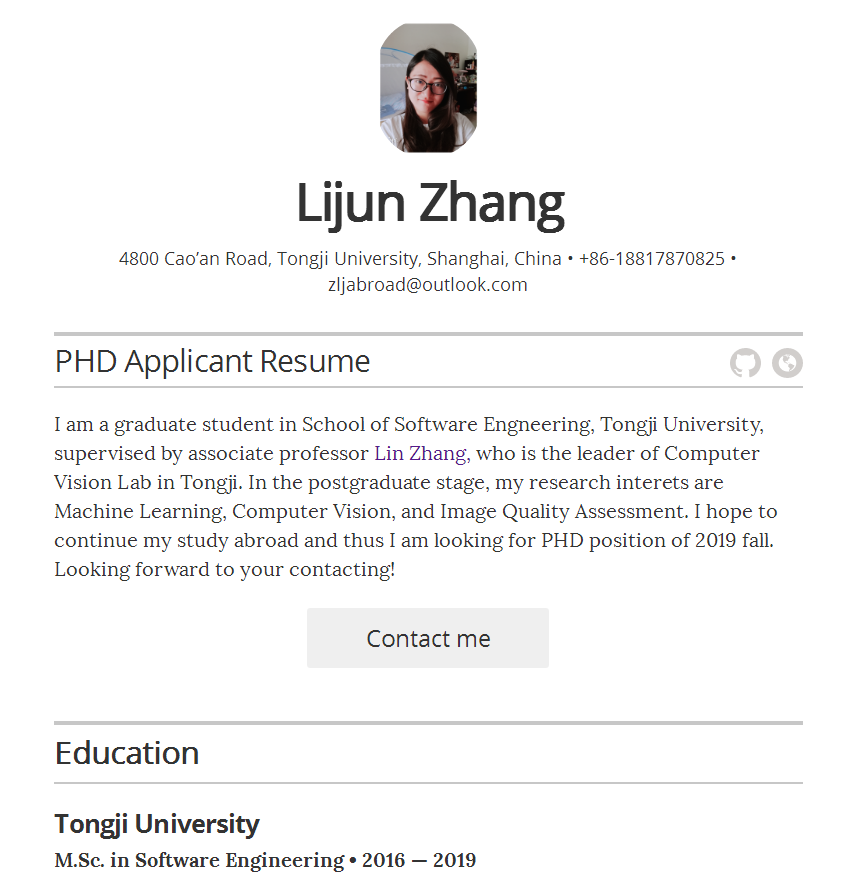

# Lijun Zhang Resume

## Description

I am a graduate student in School of Software Engneering, Tongji University, supervised by associate professor Lin Zhang, who is the leader of Computer Vision Lab in Tongji. In the postgraduate stage, my research interets are Machine Learning, Computer Vision, and Image Quality Assessment. I hope to continue my study abroad and thus I am looking for PHD position of 2019 fall. Looking forward to your contacting!

